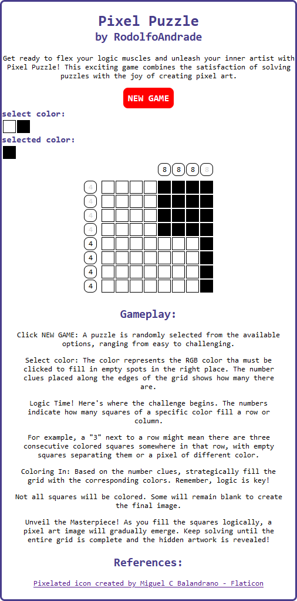

# PixelPuzzle

This repository holds the code for a web-based game called Pixel Art Logic Puzzles, where players solve logic puzzles to unveil hidden pixel art masterpieces.

## Tech Stack
* Frontend: Angular ([Angular CLI](https://github.com/angular/angular-cli) version 17.3.8.)
* Backend: Node.js (https://nodejs.org/en), Express (https://expressjs.com/)

## Running the Application
### Prerequisites:
* [Node.js](https://nodejs.org/en/learn/getting-started/how-to-install-nodejs) installed on your system.
* [Angular v17:](https://v17.angular.io/cli) `npm install -g @angular/cli@17`

### Instructions:
1. Clone this repository: `git clone https://github.com/RodolfoAndrade/pixel_puzzle.git`
1. Navigate to the project directory in your terminal: `cd pixel_puzzle`
1. Install dependencies
1. Install the game: `npm install`
1. Start the Angular development server: `ng serve`
1. Navigate to `http://localhost:4200/`
1. Have fun!
